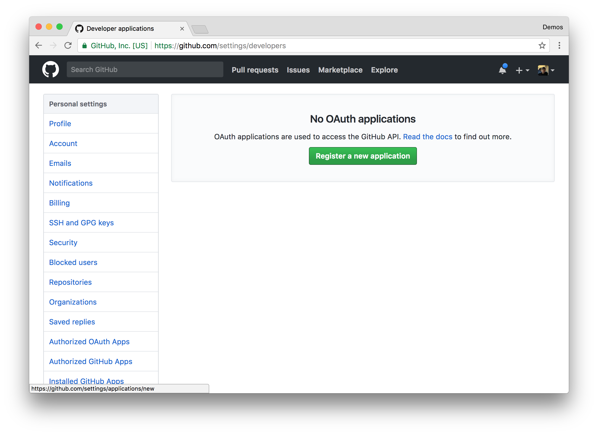
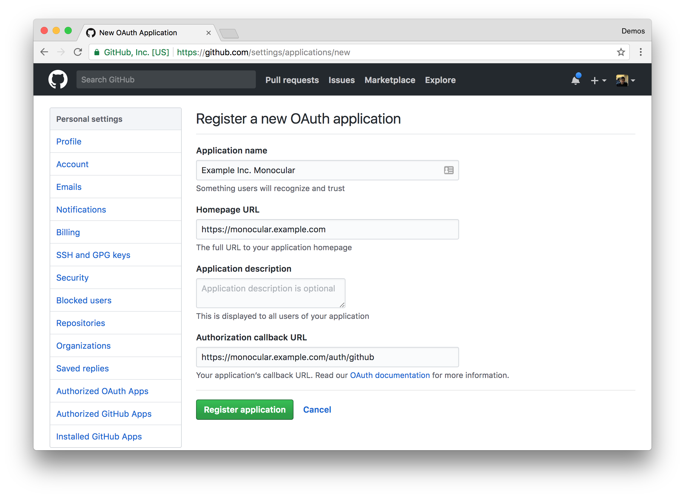
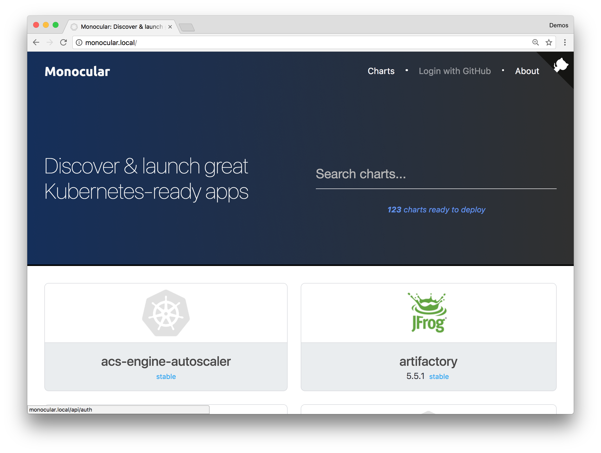
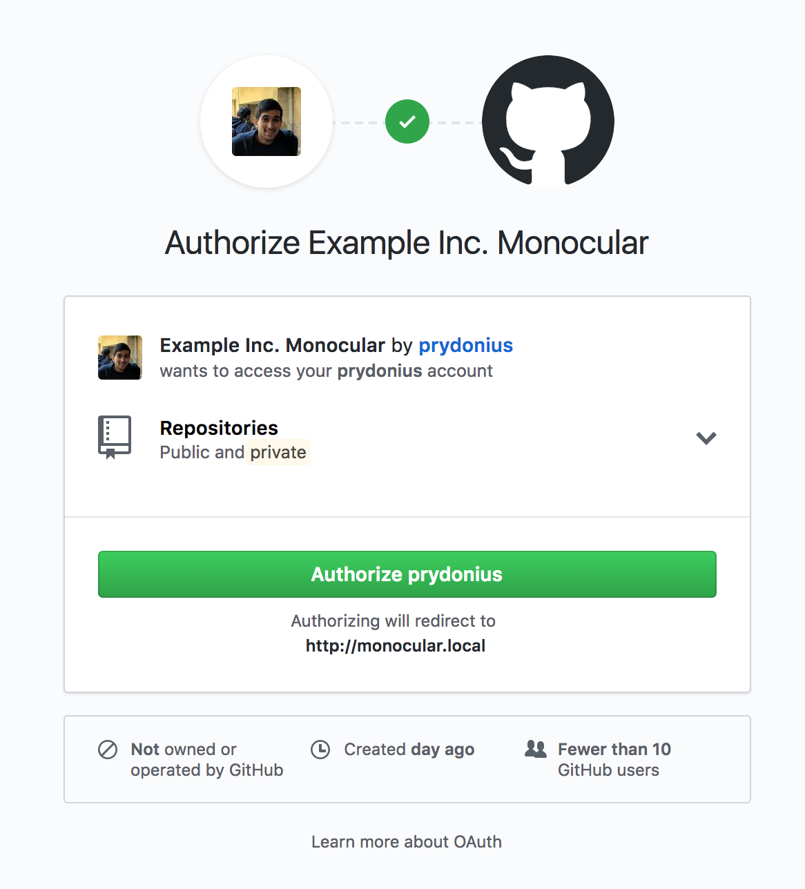
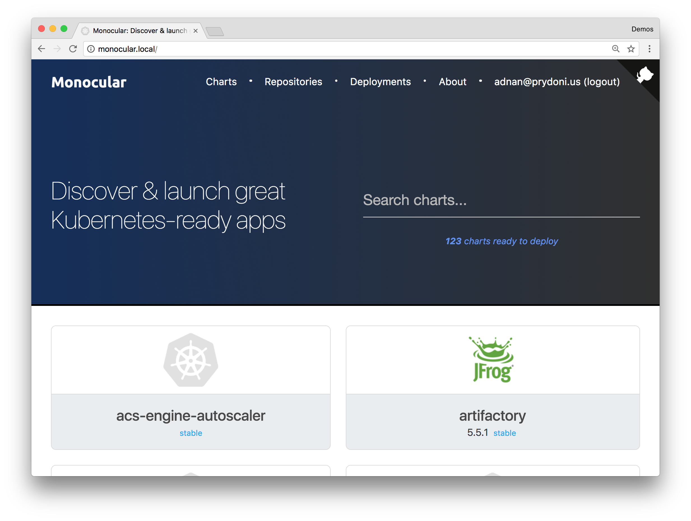

# Configuring Authentication

Monocular allows you to configure authentication on the API server in order to restrict certain operations, such as:

- Installing charts
- Managing Helm releases (deployments)
- Adding/removing chart repositories

In this initial iteration, the only supported auth provider is GitHub OAuth and authorization is not implemented. Authentication is enabled on the API server by simply providing the Client ID and secret for your GitHub OAuth application. This guide will walk through this setup.

## Creating a GitHub OAuth application

Head over to https://github.com/settings/developers to register an OAuth application that we'll use for Monocular.



Click _Register a new application_. We will need to provide GitHub with a name, homepage URL and most importantly a callback URL to create the OAuth application. The name and homepage URL are metadata for describing what the OAuth application will be used for, this is shown to the user when logging in for the first time.

The callback URL is used to return to our Monocular instance, so it is important that this is correctly set to the `/auth/github/callback` route on the API server. When installing Monocular with NGINX Ingress, we also need to prepend the route with `api` so the full URL will be `https://monocular.example.com/api/auth/github/callback`. Remember to replace `monocular.example.com` with your actual hostname.



Once you register the OAuth application, you will see the Client ID and secret generated for you. With these we can configure Monocular.

## Environment variables for API server configuration

Monocular reads in the configuration for enabling authentication using the following environment variables:

| Environment Variable | Description |
|----------------------|-------------|
| MONOCULAR_AUTH_SIGNING_KEY | Used for secure session and JWT signing |
| MONOCULAR_AUTH_GITHUB_CLIENT_ID | Client ID for GitHub OAuth app |
| MONOCULAR_AUTH_GITHUB_CLIENT_SECRET | Client secret for GitHub OAuth app |

All of these are required to be set to enable authentication.

## Configuring authentication in the Helm chart

The Monocular chart exposes values for configuring the above environment variables:

```
helm install monocular/monocular --set api.auth.signingKey=mysecret,api.auth.github.clientID=myclientid,api.auth.github.clientSecret=myclientsecret
```

## Authenticating with Monocular

Once authentication is enabled on the API server, the UI will display a login link in the header bar.



Clicking this will initiate the OAuth process with GitHub.



Once a user authorizes the Monocular application, they will be returned to Monocular and will be able to access the Repositories and Deployments tabs as well as install charts.



## Architecture

Monocular has two components, an API server and an Angular frontend. When a user completes the OAuth flow, Monocular will create a cookie containing a JSON Web Token with a 2 hour expiration. This cookie is set as _httpOnly_ and so is only accessible by the API server. A second cookie is also set which contains basic information about the user (name and email) that is displayed by the UI.
